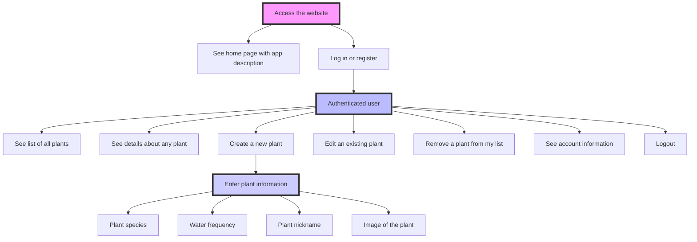
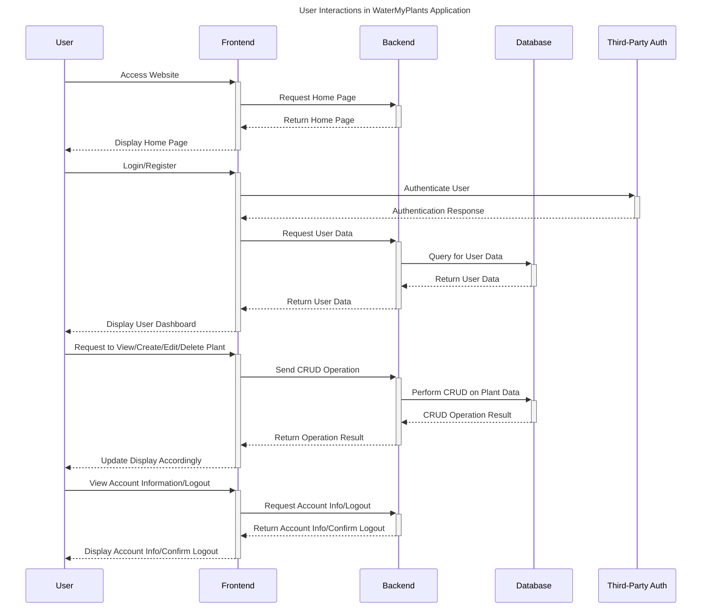

# Flowchart Diagram

```mermaid
flowchart TD
    A["Access the website"] --> B["See home page with app description"]
    A --> C["Log in or register"]
    C --> D["Authenticated user"]
    D --> E["See list of all plants"]
    D --> F["See details about any plant"]
    D --> G["Create a new plant"]
    G --> H["Enter plant information"]
    H --> I["Plant species"]
    H --> J["Water frequency"]
    H --> K["Plant nickname"]
    H --> L["Image of the plant"]
    D --> M["Edit an existing plant"]
    D --> N["Remove a plant from my list"]
    D --> O["See account information"]
    D --> P["Logout"]
    style A fill:#f9f,stroke:#333,stroke-width:4px
    style D fill:#bbf,stroke:#333,stroke-width:4px
    style H fill:#ccf,stroke:#333,stroke-width:4px
```
# Sequence Diagram 

```mermaid
sequenceDiagram
    participant U as User
    participant F as Frontend
    participant B as Backend
    participant DB as Database
    participant TP as Third-Party Auth

    title User Interactions in WaterMyPlants Application

    U->>+F: Access Website
    F->>+B: Request Home Page
    B-->>-F: Return Home Page
    F-->>-U: Display Home Page

    U->>+F: Login/Register
    F->>+TP: Authenticate User
    TP-->>-F: Authentication Response
    F->>+B: Request User Data
    B->>+DB: Query for User Data
    DB-->>-B: Return User Data
    B-->>-F: Return User Data
    F-->>-U: Display User Dashboard

    U->>+F: Request to View/Create/Edit/Delete Plant
    F->>+B: Send CRUD Operation
    B->>+DB: Perform CRUD on Plant Data
    DB-->>-B: CRUD Operation Result
    B-->>-F: Return Operation Result
    F-->>-U: Update Display Accordingly

    U->>+F: View Account Information/Logout
    F->>+B: Request Account Info/Logout
    B-->>-F: Return Account Info/Confirm Logout
    F-->>-U: Display Account Info/Confirm Logout
```
