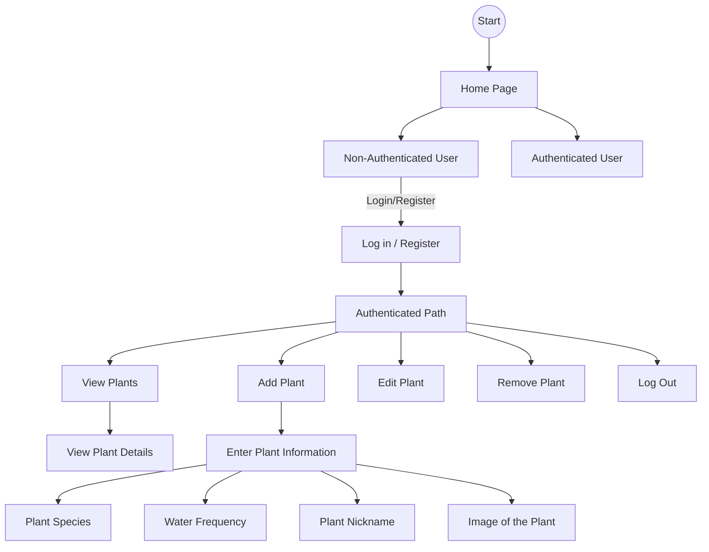

```mermaid
flowchart TD
    start((Start)) --> home["Home Page"]
    home --> nonAuth["Non-Authenticated User"]
    home --> auth["Authenticated User"]

    nonAuth -->|Login/Register| loginReg["Log in / Register"]
    loginReg --> authPath["Authenticated Path"]

    authPath --> viewPlants["View Plants"]
    authPath --> addPlant["Add Plant"]
    authPath --> editPlant["Edit Plant"]
    authPath --> removePlant["Remove Plant"]
    authPath --> logout["Log Out"]

    viewPlants --> plantDetails["View Plant Details"]
    addPlant --> enterPlantInfo["Enter Plant Information"]

    enterPlantInfo --> plantSpecies["Plant Species"]
    enterPlantInfo --> waterFrequency["Water Frequency"]
    enterPlantInfo --> plantNickname["Plant Nickname"]
    enterPlantInfo --> plantImage["Image of the Plant"]

    classDef nonAuth fill:#f9f,stroke:#333;
    classDef auth fill:#bbf,stroke:#333;
    classDef action fill:#ccf,stroke:#333;

```
