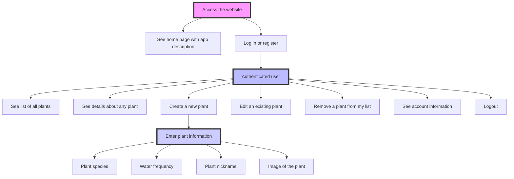

```mermaid
flowchart TD
    A["Access the website"] --> B["See home page with app description"]
    A --> C["Log in or register"]
    C --> D["Authenticated user"]
    D --> E["See list of all plants"]
    D --> F["See details about any plant"]
    D --> G["Create a new plant"]
    G --> H["Enter plant information"]
    H --> I["Plant species"]
    H --> J["Water frequency"]
    H --> K["Plant nickname"]
    H --> L["Image of the plant"]
    D --> M["Edit an existing plant"]
    D --> N["Remove a plant from my list"]
    D --> O["See account information"]
    D --> P["Logout"]
    style A fill:#f9f,stroke:#333,stroke-width:4px
    style D fill:#bbf,stroke:#333,stroke-width:4px
    style H fill:#ccf,stroke:#333,stroke-width:4px
```
